# Project Context: Temporal Legal Drift in the Indian Code

Last reviewed: 2026-08-24  
Project stage: research specification / TRL 2  
Target stage: lab-validated prototype / TRL 4

## 1. Canonical project definition

The authoritative project topic is:

> **Temporal Legal Drift in the Indian Code: Materiality Classification of Legislative Amendments and Explainable LLM-Based Compliance Reasoning**

The project will build an India Code-centred, version-aware legal benchmark and prototype that:

1. reconstructs a provision before and after an amendment;
2. identifies the amendment operation and effective date;
3. classifies the amendment's legal materiality;
4. tests whether an LLM-derived compliance assertion remains legally valid across the change; and
5. produces an evidence-grounded explanation that a legal expert can verify.

The primary research contribution is explainable amendment-materiality analysis and temporal-drift evaluation. Autonomous/agentic monitoring is a secondary extension and must not displace the benchmark, annotation, and validation work.

### Canonical decisions

- **Jurisdiction and corpus:** India; India Code, amendment Acts, Gazette notifications, rules, and other authoritative Indian legislative sources.
- **Unit of analysis:** a provision-level pre-amendment/post-amendment pair linked to one amendment event and its commencement/effective-date evidence.
- **Materiality labels:** `High`, `Medium`, `Low`, and `None`.
- **Materiality dimensions:** obligation, right, prohibition, scope, definition, threshold, time, liability, procedure, exemption, and compliance outcome. The manuscript currently lists eleven dimensions even though the review deck says ten; this must be resolved before annotation begins.
- **Primary novelty:** structured, evidence-grounded explanation of why an amendment is or is not material and how it changes a compliance outcome.
- **Secondary extension:** a human-in-the-loop legislative monitoring agent.
- **Not the current project:** an eCFR/US-regulation benchmark. eCFR material in the Markdown research notes is historical scaffolding and methodological prior work only.

## 2. What currently exists

This folder contains research and publication artifacts, not an implemented application. There is currently no ingestion code, database, dataset, model training code, API, UI, test suite, CI workflow, deployment configuration, or experiment output.

| Artifact | Current role | Status / interpretation |
|---|---|---|
| `paper/Temporal Legal Drift in the Indian Code (Professional Edition).docx` | Most polished current manuscript | Best human-readable baseline; approximately the same substantive text as the non-professional edition |
| `paper/Temporal Legal Drift in the Indian Code.docx` | Full current manuscript | Contains the complete research framing through methodology Stages 1-8, outputs, publication plan, and conclusion |
| `paper/Temporal Legal Drift in the Indian Code.BACKUP.docx` | Earlier manuscript snapshot | Historical backup; materially shorter and not authoritative |
| `paper/Review 1 Final PPT.pdf` | Review-1 project deck | Current India Code topic, objectives, TRL, timeline, outcomes, and team presentation |
| `paper/latex/main.tex` | Standalone Chapter-2 LaTeX wrapper | Loads the literature review and bibliography; sets the chapter counter to 2 |
| `paper/latex/literature_review.tex` | LaTeX literature-review source | Internally consistent citations, but currently stops at the central research gap and is less complete than the DOCX manuscript |
| `paper/latex/references.bib` | LaTeX bibliography | 29 entries; all 29 are cited and no cited keys are missing |
| `paper/literature_review_materiality_classification.md` | Earlier general materiality literature review | Useful evidence base; not the canonical India Code specification |
| `paper/adversarial_novelty_review_version_revocable_certificates.md` | First adversarial novelty review | Historical reasoning that narrowed the original certificate-oriented idea |
| `paper/adversarial_review_2_materiality_classifier_benchmark.md` | Second adversarial review | Important methodological risks, baselines, annotation cautions, and novelty positioning |
| `paper/paper_plan_materiality_classifier.md` | Reframed implementation/paper plan | eCFR-specific predecessor; reuse its experimental rigor, not its jurisdiction or data source |
| `paper/Food_Safety_Research_Topics_Prioritized.docx` | Origin of the broader research direction | Background only; food-safety certificate architecture is out of the current project scope |
| `paper/flowsight_transactions_april_2026.csv` | Incorrectly named file | It is not CSV data. It is byte-for-byte identical to `Review 1 Final PPT.pdf` and must not be used as a dataset |
| `paper/.claude/settings.local.json` | Local tool permissions | Allows web research and a LaTeX version check; not a runtime/application configuration |
| `paper.zip` | Complete archive snapshot | Valid ZIP; archived project files match the current live copies exactly, so it is a snapshot rather than a newer source |

Hidden `.DS_Store` files are operating-system metadata and have no project role.

## 3. End-to-end target architecture

### 3.1 System flow

```mermaid
flowchart LR
    A[Authoritative legal sources\nIndia Code, Amendment Acts, Gazette, Rules]
    B[Acquisition and provenance capture]
    C[Raw immutable evidence store]
    D[Legal document parser and normalizer]
    E[Provision identity and temporal version graph]
    F[Pre/post amendment pair and structural diff builder]
    G[Expert annotation workspace]
    H[Gold materiality benchmark]
    I[Baselines and materiality classifier]
    J[Explainable justification generator]
    K[Pre/post LLM compliance evaluation]
    L[Temporal drift metrics and error analysis]
    M[Expert validation and reproducible release]
    N[Optional human-in-the-loop monitoring agent]

    A --> B --> C --> D --> E --> F
    F --> G --> H
    H --> I --> J
    F --> K
    J --> K --> L --> M
    E --> N
    I --> N
    J --> N
```



### 3.2 Architecture layers

#### A. Legal source and evidence layer

Sources must be authoritative and retained exactly as acquired. Each source record needs URL or official identifier, retrieval timestamp, content hash, publication date, assent/enactment date, commencement/effective date, jurisdiction, instrument type, and acquisition method. Raw evidence is immutable; corrections create new versions rather than overwriting old records.

#### B. Parsing and normalization layer

Convert heterogeneous HTML/PDF/text sources into a common legal structure:

`Act -> Part/Chapter -> Section -> Subsection -> Clause -> Proviso/Explanation/Schedule`

Normalization must preserve the original text, structural path, source-page reference where available, cross-references, amendment verbs (`insert`, `substitute`, `omit`, `repeal`), and dates. OCR-derived text must be marked as OCR and must retain a link to the source image/PDF.

#### C. Temporal version and provenance layer

Assign stable provision identifiers and represent each provision version with a validity interval. Link amendment events to the exact affected provision versions. The core query is:

> What text and legal state of provision P was in force on date T, and which official evidence establishes that state?

At minimum, distinguish source publication time from legal effective time. Never assume that publication, enactment, and commencement dates are interchangeable.

#### D. Change extraction layer

Generate aligned pre/post provision pairs with:

- exact before and after text;
- token and sentence diffs;
- structural edit operations;
- changed numbers, dates, negations, definitions, duties, exceptions, penalties, and cross-references;
- surrounding section context; and
- amendment-event and provenance links.

The diff is evidence for classification, not the materiality decision itself. A one-token threshold change can be highly material, while a large renumbering may have no material effect.

#### E. Annotation and benchmark layer

Two legally trained annotators independently label each pair; a third expert adjudicates guideline-resolvable disagreements. Store the individual labels and rationales rather than only the final gold label. The annotation unit contains:

- materiality level: `High | Medium | Low | None`;
- affected legal dimensions;
- amendment operation;
- expected compliance consequence;
- quoted before/after evidence spans;
- rationale;
- confidence;
- annotator ID and guideline version; and
- disagreement/adjudication status.

Do not silently introduce `cosmetic/substantive/contested` from the older eCFR plan. If the team wants a contested category or continuous materiality score, approve it as a documented schema change and define its mapping to the four canonical levels first.

#### F. Modelling layer

Evaluate increasingly strong baselines before claiming a new model contribution:

1. majority and class-prior baselines;
2. edit distance and amendment-operation features;
3. rule-based legal cues for thresholds, duties, prohibitions, exceptions, deadlines, and penalties;
4. general document-revision classifier;
5. zero/few-shot LLM judge at multiple model tiers;
6. fine-tuned legal encoder / long-context encoder; and
7. the proposed materiality model, including calibrated confidence or abstention.

Train/validation/test splits must prevent leakage across near-duplicate provisions, the same amendment event, the same Act, and time. Include at least one Act- or domain-held-out evaluation.

#### G. Explainability layer

Every prediction should produce a structured justification containing:

- legal instrument and provision path;
- applicable dates and version identifiers;
- before/after evidence;
- amendment operation;
- affected legal dimensions;
- predicted materiality and confidence;
- reason for the classification;
- expected compliance effect; and
- uncertainty or escalation reason.

An explanation fails if it is fluent but not entailed by the cited legal evidence.

#### H. Temporal LLM evaluation layer

For a fixed compliance scenario, generate or evaluate an assertion against both the pre-amendment and post-amendment legal contexts. Compare the assertion, answer, citation, and explanation against expert ground truth.

Core drift outcomes:

- **correct stability:** answer remains the same after a non-material amendment;
- **correct update:** answer changes appropriately after a material amendment;
- **false stability:** answer fails to change after a material amendment;
- **false instability:** answer changes after a non-material amendment;
- **citation drift:** answer cites the wrong or superseded provision;
- **explanation drift:** conclusion may be correct but rationale relies on stale law.

#### I. Validation and release layer

Release a frozen, versioned benchmark with a data card, annotation guideline, source/provenance manifest, dataset-generation code, legal/ethical limitations, model cards, experiment configuration, and reproducible results. Raw-source redistribution must be reviewed for source terms and institutional requirements; where redistribution is unsuitable, release identifiers, hashes, extraction scripts, and derived annotations as permitted.

#### J. Optional agentic monitoring layer

Only after the benchmark and classifier pass validation, an agent may monitor official sources, detect new amendment events, build new version pairs, classify materiality, generate an evidence-grounded impact report, and route uncertain/high-impact changes to a legal expert. It must never auto-publish a legal conclusion without provenance, confidence, audit logs, and a human escalation path.

## 4. Core logical data model

| Entity | Minimum fields |
|---|---|
| `legal_instrument` | stable ID, title, Act/rule/notification type, jurisdiction, ministry, official identifier |
| `source_artifact` | source ID, official URL/reference, retrieved-at, hash, media type, publication date, raw location |
| `provision` | stable provision ID, instrument ID, structural path, parent ID |
| `provision_version` | version ID, provision ID, exact text, valid-from, valid-to, source ID, extraction confidence |
| `amendment_event` | event ID, amending instrument, operation, target provision, publication/enactment/commencement dates |
| `version_pair` | pair ID, before-version ID, after-version ID, event ID, aligned context, generated diff |
| `annotation` | pair ID, annotator, guideline version, level, dimensions, rationale, evidence spans, confidence |
| `gold_label` | pair ID, gold level, agreement statistics, adjudication status, final rationale |
| `compliance_scenario` | scenario ID, facts, legal question, reference date, expected outcome |
| `llm_assertion` | scenario, version, model/prompt/config, answer, citations, explanation, timestamp |
| `evaluation_result` | prediction, gold label, drift type, metric values, error category, reviewer notes |

All derived records must be traceable back to immutable official source evidence.

## 5. Phase-by-phase implementation plan

Each phase ends with a gate. Work should not move to the next phase until the gate passes or the deviation is explicitly recorded.

### Phase 0 - Scope and research contract

**Deliverables**

- one approved problem statement and contribution claim;
- canonical India Code corpus scope (Acts/domains and date range);
- research questions, exclusions, success metrics, and risk register;
- decision on the four materiality levels and the eleven-versus-ten dimension discrepancy;
- explicit separation of core work from the optional agentic extension.

**Outcome**

The team, guide, annotators, and implementers build the same project.

**Consistency gate**

- No active specification names eCFR as the primary corpus.
- Slides, manuscript, annotation guide, schemas, and repository README/context use the same title, label set, and novelty claim.
- Claims distinguish a domain-specific benchmark contribution from invention of edit-significance classification generally.

### Phase 1 - Legal source protocol and pilot corpus

**Deliverables**

- authoritative-source hierarchy and acquisition policy;
- a small, manually verified pilot set of Acts, amendment Acts, and Gazette evidence;
- provenance manifest and file-hashing convention;
- legal date rules for publication, enactment, and commencement.

**Outcome**

A defensible source-of-truth protocol exists before automation.

**Consistency gate**

- Every pilot item resolves to an official source and stored hash.
- A legal reviewer verifies effective dates and provision identity.
- No current consolidated text is treated as historical text without amendment evidence.

### Phase 2 - Ingestion and structural normalization

**Deliverables**

- repeatable acquisition pipeline;
- parsers/OCR workflow with confidence flags;
- normalized instrument/provision schema;
- raw, normalized, and error/quarantine zones;
- unit tests using hand-checked fixtures.

**Outcome**

Official documents become structured, traceable legal records without losing source fidelity.

**Consistency gate**

- Re-running ingestion is idempotent.
- Hashes, counts, hierarchy, text spans, and metadata reconcile with the pilot evidence.
- OCR or parsing failures are quarantined rather than silently accepted.

### Phase 3 - Temporal version reconstruction

**Deliverables**

- stable provision identity rules;
- amendment-event extraction and linking;
- version graph with validity intervals;
- point-in-time provision query;
- manually verified gold timeline for the pilot Acts.

**Outcome**

The system can reconstruct which version of a provision was in force on a specified date.

**Consistency gate**

- No overlapping validity intervals for the same provision unless the legal reason is recorded.
- Every version transition has amending-instrument and commencement evidence.
- A legal expert reproduces a sample of timelines from the official sources.

### Phase 4 - Diff construction and annotation guideline

**Deliverables**

- aligned pre/post pairs and structural diffs;
- materiality guideline with positive, negative, and boundary examples;
- explanation template and evidence-span rules;
- annotation tool/export format;
- 50-pair double-annotated pilot.

**Outcome**

Materiality is operationally defined before full-scale labelling.

**Consistency gate**

- Labels and dimensions exactly match the approved schema.
- Pilot agreement is reported using Cohen's/Fleiss' kappa and preferably Krippendorff's alpha.
- Guideline changes are versioned and affected pilot records are re-annotated.
- Disagreement is preserved; it is not erased by undocumented majority voting.

### Phase 5 - Gold benchmark construction

**Deliverables**

- expert-labelled benchmark with provenance;
- adjudication log and agreement statistics;
- leakage-resistant train/validation/test splits;
- class/distribution analysis and data card;
- frozen benchmark version 1.0.

**Outcome**

A reusable India Code amendment-materiality research asset exists.

**Consistency gate**

- Counts reconcile from raw source -> amendment event -> version pair -> annotation -> gold record.
- Duplicate/near-duplicate pairs and same-event leakage are checked.
- Each label has sufficient representation or metric limitations are disclosed.
- Dataset license/redistribution and personal-data risks are reviewed.

### Phase 6 - Baselines and proposed classifier

**Deliverables**

- reproducible baseline implementations;
- proposed model and experiment configurations;
- macro-F1, per-class precision/recall/F1, confusion matrices, calibration, and confidence intervals;
- held-out Act/domain test, ablations, and false-negative analysis.

**Outcome**

The project demonstrates whether specialised materiality modelling adds value beyond simple diffs, general revision classifiers, LLM judges, and legal encoders.

**Consistency gate**

- All models use identical frozen splits and label definitions.
- Seeds, prompts, model versions, dependencies, and hyperparameters are recorded.
- Statistical comparisons use paired tests or bootstrapping.
- The highest-risk error—material change predicted as non-material—is reported separately.

### Phase 7 - Explainable materiality analysis

**Deliverables**

- structured explanation generator;
- evidence-grounding/faithfulness checks;
- expert evaluation rubric covering legal relevance, completeness, temporal correctness, usefulness, and contestability;
- explanation error taxonomy.

**Outcome**

Predictions become auditable legal research outputs rather than unsupported labels.

**Consistency gate**

- Every explanation cites the correct versions and source evidence.
- Claimed legal dimensions and compliance consequences are supported by before/after text.
- Unsupported explanations fail validation even when the classification label is correct.

### Phase 8 - Temporal LLM drift benchmark

**Deliverables**

- fixed compliance scenarios linked to provision versions;
- controlled pre/post prompts and model-run manifest;
- false-stability, false-instability, citation-drift, explanation-drift, temporal-consistency, and legal-validity metrics;
- model-by-model error analysis.

**Outcome**

The research measures whether LLM compliance reasoning responds appropriately to legal change.

**Consistency gate**

- Scenario facts remain constant across pre/post runs; only the applicable legal version changes.
- Model, prompt, temperature, retrieval settings, and evaluation rules are held constant or the variation is documented.
- Expert ground truth determines whether the expected answer should change.

### Phase 9 - Expert validation and reproducibility release

**Deliverables**

- blinded legal-expert validation study;
- benchmark, code, configuration, data card, model card, and limitations statement;
- reproducibility script and fresh-environment verification;
- paper-ready tables/figures and traceable result manifest.

**Outcome**

The prototype reaches a defensible lab-validated TRL 4 research result.

**Consistency gate**

- Published tables are generated from recorded experiment outputs, not copied manually.
- A clean run reproduces headline metrics within stated tolerance.
- Citations and novelty claims are checked against primary sources.
- The paper, deck, dataset card, and repository report the same scope, counts, splits, and metrics.

### Phase 10 - Optional agentic monitoring extension

**Deliverables**

- source monitor and change detector;
- orchestration workflow with audit log;
- uncertainty/high-impact escalation queue;
- human approval interface and incident tests.

**Outcome**

A monitored amendment can produce a reviewable, evidence-grounded compliance-impact alert.

**Consistency gate**

- The agent cannot bypass provenance, confidence, or human escalation controls.
- Duplicate alerts are suppressed idempotently.
- Source outages, malformed documents, contradictory dates, and low-confidence cases fail safely.
- Agent performance is reported separately from benchmark/model performance.

## 6. Cross-phase consistency controls

Maintain these controls throughout implementation:

1. **Canonical terminology registry:** one definition for temporal legal drift, provision version, amendment event, materiality, effective date, false stability, and false instability.
2. **Schema versioning:** annotation guidelines, label taxonomy, data schemas, prompts, and benchmark releases each carry immutable version IDs.
3. **Provenance chain:** every table row, prediction, explanation, and paper result traces to source artifact hashes and code/config versions.
4. **Stage reconciliation:** record counts at every transition and fail builds on unexplained losses or duplicates.
5. **Leakage audit:** group by Act, provision lineage, amendment event, source document, and near-duplicate text before splitting.
6. **Legal review gates:** effective dates, gold labels, and compliance consequences require qualified human review.
7. **Experiment reproducibility:** lock environments, seeds, prompts, model identifiers, and evaluation scripts.
8. **Claim-to-evidence matrix:** every novelty, accuracy, and legal claim in the paper maps to a cited source or a reproducible project result.
9. **Artifact consistency:** manuscript, LaTeX, deck, data card, and repository context must agree on scope, labels, dimensions, counts, dates, and metrics.
10. **Human-in-the-loop boundary:** uncertainty and high-impact findings are escalated; the system is research decision support, not autonomous legal advice.

## 7. Known issues requiring action

| Priority | Issue | Required resolution |
|---|---|---|
| Critical | `flowsight_transactions_april_2026.csv` is actually the review PDF and has the same SHA-256 as that PDF | Do not parse it as data. Later, remove or rename it only with explicit approval; obtain the real dataset if one was intended |
| Critical | No implementation or benchmark data exists yet | Start with Phase 0 and the legally verified pilot corpus; do not begin model training first |
| High | Older Markdown plan specifies eCFR/US data | Treat it as historical methodology only; remove eCFR claims from active India Code specifications |
| High | Label schemes conflict: old notes use cosmetic/substantive/contested, current manuscript uses High/Medium/Low/None | Approve one schema before annotation; current canonical schema is High/Medium/Low/None, with disagreement stored separately |
| High | The deck says ten legal dimensions, while the manuscript enumerates eleven including compliance outcome | Decide whether compliance outcome is a materiality dimension or a separate downstream field, then update every artifact |
| High | LaTeX literature review is less complete than the DOCX manuscript | Choose a publication source of truth and synchronize intentionally; do not edit both independently |
| Medium | Two current DOCX files contain essentially the same text, plus an older backup | Use the Professional Edition as the review copy unless the team chooses otherwise; preserve the backup as historical |
| Medium | `paper.zip` exactly mirrors the current files and can be mistaken for a newer source | Treat it as a frozen snapshot and version future archives explicitly |
| Medium | Several citations are from 2025-2026 and some may be preprints or emerging work | Verify bibliographic metadata and novelty claims against primary sources before submission |
| Medium | The repository has no Git history or automated checks | Initialize version control and CI only when authorized; this review intentionally created no such files |

## 8. Recommended future repository layout

The following is a target layout only; it has not been created:

```text
project/
  context.md
  README.md
  pyproject.toml or equivalent environment lock
  configs/
  data/
    raw/                 # immutable official-source artifacts
    normalized/          # parsed legal structure
    interim/             # timelines and version pairs
    annotations/         # individual and adjudicated labels
    releases/            # frozen benchmark versions
  schemas/
  src/
    acquisition/
    parsing/
    temporal/
    diffing/
    annotation/
    models/
    explainability/
    evaluation/
    monitoring/          # optional extension
  tests/
    fixtures/
    unit/
    integration/
    legal_validation/
  experiments/
  reports/
  paper/
```

## 9. Definition of project completion

The core project is complete when a fresh, documented run can take authoritative Indian legislative evidence, reconstruct legally applicable provision versions, create traceable amendment pairs, classify their materiality using a validated four-level taxonomy, produce evidence-grounded explanations, evaluate pre/post LLM compliance assertions for temporal drift, reproduce the published metrics, and pass independent legal-expert review.

The optional agentic monitor is not required for the core project to be complete.
