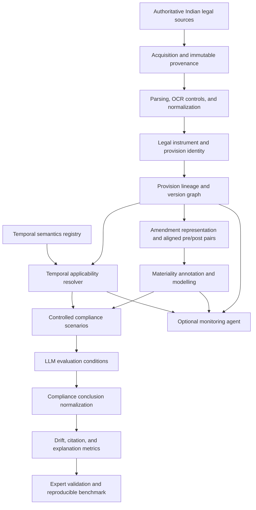

# Definitive Research and Implementation Plan

## Temporal Legal Drift in the Indian Code

**Status:** Research specification; TRL 2  
**Target:** Lab-validated research prototype; TRL 4  
**Core orientation:** Temporal legal reasoning and compliance-drift evaluation over versioned Indian law  
**Implementation status:** The Phase 0-4 engineering foundation now exists: research-contract validation, provenance-controlled acquisition, immutable raw storage, parsing/normalization, a technical provision-version graph, an evidence-constrained temporal applicability resolver, tests, gates, and CI. A fourteen-document India Code technical pilot has been downloaded and normalized locally. The real-corpus graph contains consolidated snapshots and unresolved amendment candidates, not legally approved historical transitions; no real applicability determination is legal gold. Phase 0-4 research/legal/data gates therefore remain pending. No approved benchmark, materiality model, compliance-scenario evaluation, experimental result, or monitoring agent exists.

This plan defines intended work. It does not report completed implementation, collected data, model performance, legal validation, or experimental results.

---

## 1. Project Definition

The project will design and evaluate a temporally versioned India Code benchmark for determining whether LLM-based compliance systems correctly propagate legally applicable changes in Indian law over time.

The planned end-to-end research flow is:

```text
India Code and other authoritative Indian legal sources
    -> historical provision reconstruction
    -> temporal applicability determination
    -> amendment representation
    -> materiality analysis
    -> controlled compliance scenarios
    -> pre/post LLM compliance reasoning
    -> false stability / false instability
    -> citation drift / explanation drift
    -> expert validation
    -> reproducible benchmark release
```

Materiality classification is an intermediate research component. The project is not defined as a standalone amendment classifier. Its central object is the behaviour of compliance reasoning across legally applicable versions of Indian law.

### Primary research question

> **Do LLM-based compliance systems correctly propagate legally applicable changes in Indian law over time?**

### Intended core contribution

> **A temporally versioned India Code benchmark and evaluation framework that tests whether LLM compliance reasoning correctly propagates legally material legislative changes, while distinguishing genuine legal drift from non-material textual change and grounding conclusions in authoritative evidence.**

---

## 2. Research Problem

An LLM compliance assertion can fail temporally even when it is fluent, cites a real provision, and appears legally plausible. The relevant failure is not merely failure to detect that text changed. The system must determine:

1. which provision version governs the facts at the reference date;
2. what amendment transformed the relevant provision;
3. whether the amendment is legally material;
4. whether that material change affects the particular compliance scenario;
5. whether the model updates its conclusion, citation, and explanation appropriately; and
6. whether every conclusion is supported by authoritative evidence.

The research problem therefore contains three distinct decisions:

- **Materiality:** how legally significant is the amendment?
- **Temporal applicability:** which legal version governs this scenario at this time?
- **Compliance consequence:** what does the applicable law imply for these facts?

These decisions must be represented and evaluated separately. A material amendment need not change every scenario outcome, and a correct materiality label cannot compensate for applying the wrong legal version.

---

## 3. Research Questions

### RQ1 - Historical reconstruction and applicability

Can Indian legislative history be reconstructed accurately enough to determine which provision version governs a scenario at a specified date?

### RQ2 - Amendment materiality

Can legally material changes be distinguished from non-material textual changes using structured amendment representations?

### RQ3 - Compliance propagation

Do LLM compliance assertions appropriately update when the legally applicable Indian provision changes?

### RQ4 - Evidence-grounded explanation

Can evidence-grounded explanations identify the correct legal version, amendment, materiality, and compliance consequence?

Each RQ requires its own ground truth, metrics, failure analysis, and legal-validation procedure. Performance on one RQ must not be used as a proxy for another.

---

## 4. Research Hypotheses

These are testable hypotheses, not claims of established results.

### H1 - Reconstructability

A provision-lineage and amendment-event representation linked to authoritative evidence will support more reliable point-in-time legal reconstruction than using only a current consolidated provision or publication date. Success thresholds must be approved in Phase 0 and evaluated against legal-expert determinations.

### H2 - Structured materiality representation

Structured amendment information, including operation, affected legal dimensions, context, and before/after evidence, will improve materiality classification over class-prior, lexical, and edit-distance baselines. The hypothesis may be rejected if strong general revision or LLM baselines perform equivalently.

### H3 - Context-sensitive temporal drift

LLM compliance behaviour will vary across legal-context conditions. Providing reconstructed, temporally applicable legal context is expected to reduce version, applicability, citation, and compliance errors relative to underspecified or temporally ambiguous conditions. This must be tested under controlled model and prompt configurations.

### H4 - Scenario dependence

Amendment materiality alone will not fully determine whether a compliance answer should change. Expected change will depend jointly on the amendment, the applicable version, the reference date, transitional or retrospective rules where relevant, and the scenario facts.

### H5 - Evidence-grounded explanation

Explanations constrained to identify authoritative evidence, version, amendment operation, materiality, and compliance consequence will be more legally verifiable than unconstrained fluent explanations. Legal correctness must be assessed by experts on an appropriate subset rather than exclusively by an LLM judge.

---

## 5. Novelty and Positioning

### 5.1 Defensible novelty position

The project combines four elements into one evaluation framework:

1. authoritative India Code-centred provision history;
2. explicit temporal-applicability determinations;
3. amendment materiality linked to controlled compliance scenarios; and
4. pre/post evaluation of LLM conclusions, citations, and explanations.

The benchmark and evaluation framework remain scientifically useful even if no proposed model exceeds the strongest baselines.

### 5.2 Claims the project must not make

The project must not claim:

- first-ever amendment classification;
- first-ever legal change detection;
- first-ever materiality classifier;
- generic invention of legal edit-significance classification; or
- autonomous legal correctness.

### 5.3 Adjacent work and novelty audit

The repository identifies adjacent work on legal amendment detection, edit/materiality classification, temporal legal reasoning, legal version reconstruction, and LLM reasoning over changing law. The project context also flags RegTrack and recent temporal legal reasoning benchmarks as important comparators, but the repository does not establish enough verified bibliographic detail to state their precise scope here.

Before implementation begins, Phase 0 must produce a formal novelty audit that:

- verifies the closest work from primary sources;
- includes RegTrack and recent temporal legal reasoning benchmarks;
- compares tasks, jurisdictions, temporal models, units of analysis, labels, scenarios, evaluation conditions, metrics, source provenance, and release artifacts;
- identifies what is reused, adapted, or newly combined;
- determines whether a closest-work-inspired baseline is feasible; and
- creates a claim-to-evidence matrix for the final paper.

The paper must position amendment materiality as one component of temporal compliance propagation and explicitly compare the final contribution with the closest verified work.

---

## 6. Scope and Corpus

### 6.1 In scope

- India Code and other authoritative Indian legal sources needed to establish legislative text, amendments, and temporal applicability;
- provision-level history and amendment events;
- publication, enactment/assent, commencement, applicability, and legal-effect evidence;
- materiality annotation using the canonical four levels;
- controlled compliance scenarios;
- LLM pre/post reasoning evaluation;
- version, applicability, outcome, citation, and explanation evaluation;
- expert legal validation; and
- a reproducible, versioned benchmark.

### 6.2 Out of scope for the core project

- eCFR as the primary corpus;
- a generic regulatory-change classifier detached from Indian temporal applicability;
- production legal advice;
- autonomous publication of legal conclusions;
- mandatory deployment of a monitoring agent;
- unsupported claims about legal hierarchy; and
- claims of comprehensive coverage of Indian law.

### 6.3 Phase 0 corpus decisions

Before data acquisition, the team must approve:

- included legal domains and instruments;
- date range;
- central/state scope, if relevant;
- source-access and redistribution constraints;
- pilot size;
- minimum benchmark target;
- desired benchmark target;
- minimum class coverage;
- domain coverage;
- amendment-operation coverage;
- temporal-complexity coverage; and
- the cost and legal-expertise justification for those targets.

No final dataset size is established in the current repository. The approved targets must be recorded as design decisions, not retrofitted after collection.

---

## 7. Core Concepts and Formal Definitions

### 7.1 Amendment

An authoritative legal event that inserts, substitutes, omits, repeals, modifies, renumbers, or otherwise affects legal text or its operation. Detection of textual difference is not itself a materiality or applicability determination.

### 7.2 Materiality

The legal significance of an amendment independent of any one scenario outcome. The canonical levels are:

- `High`
- `Medium`
- `Low`
- `None`

The annotation guideline must formally define each level, inclusion criteria, exclusion criteria, positive examples, negative examples, boundary cases, and adjudication rules.

### 7.3 Materiality dimensions

The current manuscript discusses obligation, right, prohibition, scope, definition, threshold, time, liability, procedure, exemption, and compliance outcome. The deck describes ten dimensions, while the manuscript enumerates eleven.

Phase 0 must determine whether compliance outcome is:

- a materiality dimension; or
- a separate scenario-dependent field, which is methodologically preferable unless legal review establishes otherwise.

The exact number and definitions must be frozen before annotation.

### 7.4 Temporal applicability

The expert-supported determination of which legal provision/version governs a scenario at a reference date, given the relevant legal and factual conditions. It is not reducible to choosing the latest text or checking a single `valid_from` date.

### 7.5 Compliance consequence

The implication of the temporally applicable provision for the facts and legal question in a specific scenario. It must be annotated separately from materiality.

### 7.6 Expected and observed change

For a paired scenario evaluation:

```text
ExpectedChange in {0, 1}
ModelChange    in {0, 1}
```

- `ExpectedChange = 1`: expert ground truth says the compliance answer should change between the evaluated legal conditions.
- `ExpectedChange = 0`: expert ground truth says the answer should remain stable.
- `ModelChange = 1`: the model's normalized compliance conclusion changes.
- `ModelChange = 0`: the model's normalized compliance conclusion remains stable.

### 7.7 Drift outcomes

- **Correct update:** `ExpectedChange = 1` and `ModelChange = 1`.
- **Correct stability:** `ExpectedChange = 0` and `ModelChange = 0`.
- **False stability:** `ExpectedChange = 1` and `ModelChange = 0`.
- **False instability:** `ExpectedChange = 0` and `ModelChange = 1`.
- **Citation drift:** the conclusion or answer may be stable or changed, but the cited authority/version is incorrect, superseded, temporally inapplicable, or inconsistently propagated.
- **Explanation drift:** the conclusion may be correct, but the rationale relies on the wrong version, date, amendment, materiality reasoning, or compliance consequence.

### 7.8 Required conceptual flow

```text
AMENDMENT
  -> MATERIALITY
  -> TEMPORAL APPLICABILITY
  -> SCENARIO
  -> COMPLIANCE CONSEQUENCE
```

The implementation may compute supporting evidence in another technical order, but the benchmark must preserve these distinct judgments and their dependencies.

---

## 8. Temporal Legal Model

### 8.1 Version graph

Retain the provision-version graph:

```text
Legal Instrument
  -> Provision lineage
  -> Provision versions
  -> Amendment events
  -> Temporal applicability determinations
```

Every derived node and edge must trace to immutable authoritative evidence.

### 8.2 Temporal semantics

The model must not represent legal time only through `valid_from` and `valid_to`. It must be able to record, when supported:

- publication;
- enactment or assent;
- commencement;
- applicability to the scenario;
- legal effect;
- retrospective effect;
- transitional provisions;
- deferred commencement;
- partial commencement;
- explicit uncertainty or unresolved conflict; and
- the authoritative evidence supporting each temporal assertion.

The plan does not prescribe a legal hierarchy among sources or dates. Such rules must be validated by a qualified legal reviewer and documented in a versioned temporal-semantics registry.

### 8.3 Central temporal query

> **Given legal scenario S and reference date T, which legal provision/version governs S, and what authoritative evidence establishes that applicability?**

The resolver must return both a determination and its evidence. Where the evidence is incomplete or ambiguous, the correct result is an unresolved or escalated status, not a silently inferred date.

### 8.4 Reconstruction and applicability are separate

- **Reconstruction** establishes the text and lineage of provision versions.
- **Applicability resolution** establishes which reconstructed version governs the scenario.

A historically accurate version graph can still yield an incorrect compliance result if applicability is resolved incorrectly.

---

## 9. System Architecture



### Architectural boundaries

- Raw source evidence is immutable.
- Parsing errors are quarantined rather than accepted silently.
- Version reconstruction does not decide materiality.
- Materiality does not decide applicability.
- Applicability does not decide the compliance consequence without scenario facts.
- Model output does not become gold truth.
- Expert validation is part of the core, not an optional post-processing step.
- The monitoring agent is downstream of validated benchmark components.

---

## 10. Data Model

The following is a conceptual schema, not an implemented database.

| Entity | Required conceptual fields |
|---|---|
| `legal_instrument` | instrument ID, title, type, jurisdiction, ministry/authority where supported, official identifier |
| `source_artifact` | source ID, official reference/URL, retrieval time, content hash, media type, publication evidence, raw location |
| `provision` | stable provision ID, instrument ID, structural path, parent ID, lineage ID |
| `provision_version` | version ID, provision ID, exact text, structural representation, source links, extraction method/confidence |
| `amendment_event` | event ID, amending instrument, target provision/version, operation, evidence, relevant legal dates |
| `temporal_fact` | fact ID, event/version ID, fact type, date/condition, source evidence, reviewer status, uncertainty |
| `applicability_determination` | scenario ID, reference date, governing version ID, reasoning, supporting temporal facts, expert status |
| `version_pair` | pair ID, before/after version IDs, amendment event, aligned context, structural and lexical diffs |
| `materiality_annotation` | pair ID, annotator, guideline version, level, dimensions, evidence spans, rationale, confidence |
| `materiality_gold` | pair ID, frozen level/dimensions, agreement, adjudication status, gold rationale |
| `compliance_scenario` | scenario ID, schema version, facts, legal question, reference date, governing version, expected answer, expected consequence, expected change, evidence, expert rationale |
| `model_run` | model/version, condition, prompt/config versions, temperature, retrieval settings, run time, seed where available |
| `llm_assertion` | run ID, scenario ID, normalized answer, raw answer, citations, explanation, confidence if supplied |
| `evaluation_result` | applicability, version, outcome, materiality, citation, explanation, and drift labels/metrics; reviewer notes |

All derived records must preserve a chain to source artifact hashes, transformation versions, annotation versions, and expert decisions.

---

## 11. Benchmark Design

### 11.1 Benchmark units

The benchmark contains linked but separately evaluable objects:

1. authoritative source artifacts;
2. provision lineages and versions;
3. amendment events;
4. temporal facts;
5. pre/post version pairs;
6. materiality annotations;
7. applicability determinations;
8. controlled compliance scenarios;
9. expected change/no-change labels;
10. model runs and assertions; and
11. expert evaluation records.

### 11.2 Benchmark tracks

- **Track A - Historical reconstruction:** recover the correct provision text/version and evidence.
- **Track B - Temporal applicability:** select the governing version for scenario S at time T.
- **Track C - Materiality:** classify the amendment level and dimensions.
- **Track D - Compliance consequence:** answer the scenario under the applicable law.
- **Track E - Temporal propagation:** determine whether the model updates appropriately across versions.
- **Track F - Evidence-grounded explanation:** justify version, amendment, materiality, and consequence.

This modular design prevents a single end-to-end score from hiding whether failure originated in parsing, reconstruction, applicability, materiality, or compliance reasoning.

### 11.3 Size and coverage decisions

Phase 0 must approve and justify:

- pilot size: retain the planned 50-pair double-annotated pilot unless legal or corpus evidence requires revision;
- minimum and desired final benchmark targets;
- class distribution and minimum examples per materiality level;
- number and diversity of legal domains and instruments;
- amendment-operation coverage;
- temporal-complexity coverage;
- scenario categories and expected-change balance;
- expert-annotation capacity and budget; and
- held-out split feasibility.

Targets are planning constraints. They must not be described later as achieved until the release manifest proves them.

### 11.4 Release policy

Each frozen release needs:

- a release version;
- source/provenance manifest;
- schema versions;
- annotation-guideline version;
- scenario-schema version;
- split manifests;
- known limitations;
- permitted redistribution statement; and
- checksums for released artifacts.

---

## 12. Annotation Protocol

### 12.1 Annotators

- two independent annotators with relevant legal training for the pilot and gold-labelled subset;
- a qualified third reviewer/adjudicator for guideline-resolvable disagreement and legally material edge cases;
- preserved annotator identities or stable pseudonymous IDs in the research record; and
- conflict-of-interest and qualification documentation appropriate to the study.

### 12.2 Annotation record

Preserve:

- individual materiality level;
- materiality dimensions;
- amendment operation;
- before/after evidence spans;
- rationale;
- confidence/uncertainty;
- temporal concerns noticed by the annotator;
- compliance-consequence notes, stored separately from materiality;
- guideline version; and
- adjudication history.

### 12.3 Taxonomy rules

The frozen guideline must define for `High`, `Medium`, `Low`, and `None`:

- inclusion criteria;
- exclusion criteria;
- positive examples;
- negative examples;
- boundary cases;
- interaction with multiple affected dimensions;
- handling of insufficient evidence; and
- adjudication rules.

Do not silently substitute the historical eCFR categories `cosmetic`, `substantive`, or `contested`. Any schema change requires explicit approval, mapping, versioning, migration, and revalidation.

### 12.4 Pilot procedure

1. Select 50 pairs according to approved diversity rules.
2. Annotate independently.
3. Preserve all labels, rationales, and evidence spans.
4. Measure agreement using the statistic appropriate to the number of annotators, label scale, missingness, and study design. Candidates include Cohen's kappa, Fleiss' kappa, and Krippendorff's alpha; not all must be used.
5. Analyse disagreement by level, dimension, amendment operation, and evidence sufficiency.
6. Revise the guideline only through a recorded version change.
7. Re-annotate affected pilot items after substantive changes.
8. Freeze the taxonomy and guideline before full annotation.

Low agreement is a methodological finding and gate failure requiring diagnosis; it must not be hidden through undocumented adjudication.

---

## 13. Compliance Scenario Design

Compliance scenarios are first-class benchmark objects, not illustrative prompts added after materiality modelling.

### 13.1 Scenario schema

Each scenario should contain:

- scenario ID;
- scenario-schema version;
- facts;
- legal question;
- reference date;
- applicable legal version;
- expected answer;
- expected compliance consequence;
- expected change/no-change;
- supporting legal evidence;
- expert rationale;
- temporal/applicability notes; and
- review/adjudication status.

### 13.2 Required scenario categories

The benchmark should deliberately sample, where supported by verified legal evidence:

- material amendment where the compliance outcome changes;
- material amendment where the scenario outcome remains unchanged;
- non-material amendment where the answer should remain stable;
- temporal traps;
- transitional-rule cases;
- deferred or partial commencement cases;
- retrospective/applicability cases where legally appropriate;
- citation traps; and
- explanation-drift cases.

No actual legal example should be added until it is supported by authoritative source evidence and expert review.

### 13.3 Scenario controls

- Hold scenario facts constant across paired pre/post evaluations unless the experiment explicitly studies fact variation.
- Separate the legal reference date from document retrieval or model-run date.
- Record which legal version experts expect to govern.
- Record why the answer should or should not change.
- Avoid scenarios whose expected answer cannot be reliably adjudicated.
- Balance changed and unchanged expected outcomes sufficiently to make both false-stability and false-instability rates meaningful.

---

## 14. Baselines

The baseline suite must be feasible for the final data scale and task formulation. Planned candidates are:

1. majority and class-prior baselines;
2. edit-distance and lexical-difference features;
3. amendment-operation features;
4. rule-based legal cues for duties, prohibitions, thresholds, dates, definitions, exceptions, procedures, and penalties;
5. a generic document-revision classifier;
6. zero-shot LLM materiality and compliance baselines;
7. few-shot LLM baselines;
8. a legal encoder;
9. a long-context encoder;
10. a baseline inspired by the closest verified legal-change benchmark methodology; and
11. the proposed materiality model, if resources permit.

Requirements:

- Do not describe a prior method as reproduced unless its implementation and validation actually support that statement.
- Record deviations from prior methodologies.
- Use the same frozen benchmark definitions and split manifests for comparable methods.
- Include strong non-neural baselines.
- Treat the proposed model as optional to the benchmark's scientific validity.
- Evaluate whether materiality predictions add explanatory value to temporal compliance propagation; do not make materiality accuracy the only headline result.

---

## 15. Temporal LLM Evaluation

### 15.1 Controlled conditions

Where technically and legally appropriate, evaluate each selected model under:

1. no legal context;
2. pre-amendment legal context;
3. post-amendment legal context;
4. both versions;
5. both versions plus explicit reference date; and
6. reconstructed temporally applicable legal context.

The conditions are designed to distinguish:

- knowledge failure;
- retrieval failure;
- temporal reasoning failure;
- applicability failure;
- compliance reasoning failure; and
- citation/explanation propagation failure.

### 15.2 Experimental controls

For comparisons intended to isolate context effects:

- hold model and model version constant;
- hold prompt template constant except for the condition-specific context;
- hold temperature and decoding settings constant;
- hold retrieval configuration constant or document the intended difference;
- preserve raw prompts and outputs;
- version system instructions, schemas, normalization rules, and evaluators;
- record run date and provider/API version where available;
- repeat stochastic runs according to a Phase 0 power/variance decision; and
- prevent model outputs from entering gold labels.

### 15.3 Answer normalization

Define a pre-registered normalization procedure that maps raw answers to the benchmark's expected compliance-answer representation. Human review must resolve ambiguous mappings on a blinded subset. Normalization must not be changed after inspecting final model rankings without a documented protocol amendment.

### 15.4 Failure attribution

Each failure should be attributed, where possible, to one or more layers:

- wrong source/retrieval;
- wrong version reconstruction;
- wrong temporal applicability;
- wrong amendment/materiality interpretation;
- wrong scenario reasoning;
- wrong normalized conclusion;
- wrong citation; or
- unfaithful explanation.

---

## 16. Explanation Evaluation

### 16.1 Explanation content

An explanation should identify:

- legal instrument;
- provision path;
- applicable date;
- version ID;
- before evidence;
- after evidence;
- amendment operation;
- affected materiality dimension;
- materiality level;
- compliance consequence;
- confidence; and
- uncertainty/escalation reason.

### 16.2 Fluency versus faithfulness

- **Fluency** concerns readability and coherence.
- **Faithfulness** concerns whether claims are supported by the correct authoritative evidence and reasoning chain.

A fluent explanation with the wrong version, date, citation, or legal consequence is a failure.

### 16.3 Evaluation dimensions

- evidence correctness;
- temporal correctness;
- entailment by cited evidence;
- completeness;
- materiality reasoning;
- compliance reasoning;
- citation precision;
- uncertainty handling; and
- usefulness/contestability for a legal reviewer.

Automated checks may support evaluation, but legal correctness must not rely exclusively on LLM-as-judge. A qualified expert must assess an approved subset using a versioned rubric and blinded procedure where feasible.

---

## 17. Metrics

### 17.1 Reconstruction and applicability

- provision identity accuracy;
- provision-version reconstruction accuracy;
- amendment-event linkage accuracy;
- temporal-fact extraction accuracy by fact type;
- temporal applicability accuracy;
- evidence/provenance completeness; and
- unresolved/abstention rate.

These metrics determine whether downstream evaluation is based on the right law. A model cannot receive credit for a correct final answer grounded in an incorrect or unsupported version.

### 17.2 Materiality

- per-class precision, recall, and F1;
- macro-F1;
- confusion matrix;
- calibration where scores are produced;
- high-materiality false-negative rate; and
- performance by dimension, amendment operation, domain, and agreement stratum.

High-materiality false negatives receive separate attention because treating a legally significant amendment as negligible can suppress a required compliance update. They must not be equated automatically with false stability, which is scenario-dependent.

### 17.3 Compliance and temporal propagation

For paired items:

```text
FalseStabilityRate = count(ExpectedChange=1 and ModelChange=0)
                     / count(ExpectedChange=1)

FalseInstabilityRate = count(ExpectedChange=0 and ModelChange=1)
                       / count(ExpectedChange=0)
```

Also report:

- compliance outcome accuracy;
- correct-update rate;
- correct-stability rate;
- results by materiality level;
- results by temporal-complexity category;
- results by evaluation condition; and
- abstention/invalid-output rate.

False stability measures failure to propagate a required legal change. False instability measures unnecessary answer change when the legally correct outcome should remain stable. Reporting both avoids rewarding systems that simply change every answer after any textual amendment.

### 17.4 Citation and version metrics

- version accuracy;
- citation accuracy;
- citation precision and recall where multiple authorities are expected;
- citation-drift rate;
- superseded-authority rate; and
- unsupported-citation rate.

### 17.5 Explanation metrics

- evidence correctness;
- temporal correctness;
- entailment/faithfulness;
- completeness;
- materiality-reasoning correctness;
- compliance-reasoning correctness;
- citation precision; and
- expert acceptability with uncertainty reported.

### 17.6 Agreement and uncertainty

Use an agreement statistic appropriate to the annotation design. Report confidence intervals and the denominator for every rate. Preserve an explicit unresolved/insufficient-evidence category at workflow level even if it is not a materiality label.

---

## 18. Leakage and Statistical Controls

### 18.1 Split strategies

At minimum, consider and justify:

- random split for comparability only;
- Act-held-out split;
- amendment-event-held-out split;
- provision-lineage-held-out split;
- temporal holdout; and
- domain-held-out split.

A random split must not be the only evaluation.

### 18.2 Leakage checks

Audit across:

- exact duplicates;
- near duplicates;
- the same amendment event;
- the same Act;
- provision lineage;
- source documents;
- adjacent versions;
- paraphrased or template-generated scenarios; and
- repeated evidence passages.

Splits must be generated from grouping keys before model training. Any unavoidable overlap must be disclosed and analysed.

### 18.3 Statistical analysis

- pre-register primary metrics and comparisons before final test evaluation;
- report confidence intervals, not only point estimates;
- use paired bootstrap, McNemar's test, or another justified paired procedure for model comparisons;
- use correction or a clearly limited hypothesis family when many comparisons are made;
- report class and domain support counts;
- separate confirmatory from exploratory analyses;
- analyse annotator-agreement strata; and
- document missing, excluded, or unresolved cases.

The final procedure depends on benchmark size and outcome distributions decided in Phase 0. No power or significance claim should be made before those inputs exist.

---

## 19. Phase-by-Phase Implementation Plan

Every phase is sequentially gated. Downstream work may be prototyped for feasibility, but results must not be treated as valid until all upstream gates pass.

### Phase 0 - Research contract and novelty audit

**Objective**

Freeze the research problem, scope, terminology, novelty position, benchmark targets, and validation strategy.

**Inputs**

- current project context and manuscripts;
- Review 1 deck;
- adversarial reviews and historical materiality plan;
- verified primary literature gathered during the novelty audit; and
- legal/research-methodology reviewer input.

**Implementation tasks**

- approve the primary RQ and four core RQs;
- verify RegTrack and closest temporal/legal-change work;
- build the novelty and claim-to-evidence matrix;
- freeze in-scope corpus categories and date range;
- decide pilot, minimum, and desired benchmark targets with justification;
- resolve the ten-versus-eleven dimension discrepancy;
- separate materiality dimensions from compliance consequence;
- define success thresholds for reconstruction, applicability, agreement, and reproduction;
- approve temporal semantics and expert-validation protocols; and
- register core versus optional work.

**Outputs**

- approved research contract;
- novelty-audit matrix;
- scope and exclusions;
- terminology and temporal-semantics registry v1;
- benchmark-size/coverage decision;
- risk register;
- pre-registered primary metrics and comparison plan; and
- claim-to-evidence matrix.

**Validation checks**

- no active eCFR primary-corpus framing;
- no unsupported first-ever claim;
- materiality is intermediate, not the sole novelty;
- applicability and scenarios are first-class;
- exact label/dimension definitions are internally consistent; and
- expert roles and resources are feasible.

**Gate**

Proceed only after the research lead and qualified legal reviewer approve the research contract and novelty position.

**Failure conditions**

- closest work duplicates the intended contribution without a defensible distinction;
- corpus access or legal expertise is infeasible;
- benchmark targets are unjustified; or
- core concepts remain contradictory.

**Dependencies**

None.

### Phase 1 - Authoritative corpus/source protocol

**Objective**

Define how authoritative Indian legal evidence is identified, acquired, stored, verified, and cited.

**Inputs**

- Phase 0 scope;
- authoritative-source candidates; and
- legal-review rules.

**Implementation tasks**

- define source acceptance and priority rules without inventing unsupported hierarchy;
- define immutable raw storage and hashing;
- capture official identifiers, URLs/references, retrieval times, and media types;
- define treatment of scanned/OCR documents;
- define publication, enactment/assent, commencement, and legal-effect evidence capture;
- select the pilot corpus; and
- manually verify a sample end to end.

**Outputs**

- source protocol;
- provenance schema;
- pilot source manifest;
- immutable source artifacts when later implementation is authorised; and
- exception/quarantine policy.

**Validation checks**

- every pilot item has authoritative evidence and a hash;
- identifiers and retrieval records reconcile;
- OCR status is explicit;
- missing or contradictory evidence is flagged; and
- redistribution constraints are recorded.

**Gate**

Proceed only when a legal reviewer accepts the pilot sources as sufficient to support reconstruction work.

**Failure conditions**

- source authenticity cannot be established;
- relevant historical evidence is inaccessible;
- evidence is silently replaced by current consolidated text; or
- provenance cannot be reproduced.

**Dependencies**

Phase 0.

### Phase 2 - Parsing and normalization

**Objective**

Transform authoritative source artifacts into structured legal records without losing text fidelity or provenance.

**Inputs**

- approved pilot source artifacts and manifest;
- source protocol; and
- structural schema.

**Implementation tasks**

- parse legal instrument hierarchy;
- preserve exact source text and page/section anchors where available;
- normalize structural paths and cross-references;
- identify amendment verbs and candidate targets;
- record extraction method and confidence;
- quarantine parse/OCR failures; and
- create hand-checked fixtures and tests.

**Outputs**

- normalized pilot records;
- parse-error and quarantine reports;
- source-to-normalized trace map; and
- parser validation fixtures.

**Validation checks**

- exact-text and hierarchy reconciliation against the source;
- idempotent re-processing;
- stable IDs under repeated runs;
- no silent OCR correction;
- cross-reference spot checks; and
- stage counts reconcile.

**Gate**

Proceed only when the approved sample meets Phase 0 parsing/fidelity thresholds and all material discrepancies are resolved or quarantined.

**Failure conditions**

- systematic text loss;
- unstable structure or IDs;
- untraceable normalization;
- unacceptable OCR error; or
- unexplained record loss/duplication.

**Dependencies**

Phases 0-1.

### Phase 3 - Provision identity and temporal version reconstruction

**Objective**

Construct reliable provision lineages, versions, and amendment-event links.

**Inputs**

- normalized legal records;
- authoritative amendment evidence; and
- versioning rules.

**Implementation tasks**

- define stable provision and lineage identity;
- align amendment targets to affected provisions;
- create provision-version nodes;
- represent insertions, substitutions, omissions, repeals, renumbering, and splits/merges where supported;
- link every transition to authoritative evidence;
- build a manually verified reconstruction set; and
- implement point-in-time reconstruction queries during later implementation.

**Outputs**

- provision-lineage graph;
- amendment-event records;
- version-transition records;
- reconstruction gold sample; and
- unresolved-link report.

**Validation checks**

- expert comparison with authoritative documents;
- no unexplained cycles or orphan versions;
- no silent conflation of renumbering with substantive replacement;
- every transition has evidence;
- source and stage counts reconcile; and
- reconstruction error analysis is documented.

**Gate**

**Historical provision reconstruction must work.** Proceed only when a qualified legal reviewer confirms that the approved sample reconstructs the correct provision text and lineage under the Phase 0 thresholds.

**Failure conditions**

- provision identities are unstable;
- amendment targets cannot be linked reliably;
- reconstructed text conflicts with authoritative evidence;
- transition provenance is missing; or
- unresolved cases exceed the approved tolerance.

**Dependencies**

Phases 0-2.

### Phase 4 - Temporal applicability resolver

**Objective**

Determine which reconstructed provision version governs scenario S at reference date T using authoritative temporal evidence.

**Inputs**

- version graph;
- temporal-semantics registry;
- publication, enactment/assent, commencement, applicability, legal-effect, retrospective, transitional, deferred, and partial-commencement evidence where relevant; and
- expert-reviewed pilot scenarios.

**Implementation tasks**

- represent temporal facts and conditions separately from version text;
- implement applicability determinations with traceable reasoning;
- support unresolved/ambiguous outcomes and escalation;
- distinguish publication from commencement and scenario applicability;
- model retrospective and transitional effects only when supported; and
- validate determinations against legal-expert ground truth.

**Outputs**

- applicability schema and resolver specification;
- applicability gold sample;
- temporal reasoning traces;
- uncertainty/escalation report; and
- temporal error taxonomy.

**Validation checks**

- correct governing-version selection;
- complete evidence trace;
- correct handling of temporal traps in the pilot;
- no latest-version heuristic masquerading as applicability;
- unresolved cases remain unresolved; and
- expert agreement is measured.

**Gate**

**Temporal applicability must be legally validated.** No compliance scenario may enter the benchmark without an approved applicability determination or an explicit unresolved label.

**Failure conditions**

- date semantics are collapsed into `valid_from/valid_to`;
- unsupported legal hierarchy is encoded;
- governing versions cannot be expert-validated;
- evidence is incomplete; or
- ambiguous cases are forced into confident answers.

**Dependencies**

Phases 0-3.

### Phase 5 - Amendment representation and materiality annotation

**Objective**

Create structured pre/post amendment pairs and freeze a reliable four-level materiality taxonomy.

**Inputs**

- validated version pairs;
- amendment events;
- Phase 0 dimension decision;
- authoritative evidence; and
- draft annotation guideline.

**Implementation tasks**

- generate lexical and structural diffs;
- represent operation, affected text, context, and legal dimensions;
- complete the 50-pair double-annotated pilot;
- preserve individual labels, rationales, evidence spans, and confidence;
- measure appropriate inter-annotator agreement;
- adjudicate under written rules;
- revise and version the guideline; and
- re-annotate affected items after substantive revisions.

**Outputs**

- structured amendment-pair schema;
- pilot annotations;
- agreement and disagreement report;
- annotation guideline and taxonomy version; and
- frozen materiality schema.

**Validation checks**

- `High/Medium/Low/None` definitions are complete;
- inclusion/exclusion and boundary rules are usable;
- dimensions are separate from compliance consequence;
- evidence spans support rationales;
- disagreements and adjudications are traceable; and
- pilot coverage matches the approved sampling plan.

**Gate**

**The annotation taxonomy must be frozen.** Full annotation and modelling cannot begin until agreement and guideline quality meet Phase 0 criteria or the research contract is explicitly revised.

**Failure conditions**

- unresolved ten-versus-eleven dimension conflict;
- materiality and scenario consequence are collapsed;
- low agreement is unexplained;
- individual labels/rationales are discarded; or
- obsolete category labels are introduced without schema approval.

**Dependencies**

Phases 0-4.

### Phase 6 - Controlled compliance-scenario construction

**Objective**

Build expert-validated scenarios that isolate whether legally applicable change should alter a compliance answer.

**Inputs**

- validated applicability determinations;
- frozen amendment/materiality records;
- scenario schema; and
- legal-expert authorship/review.

**Implementation tasks**

- construct scenario facts and legal questions;
- assign reference dates and governing versions;
- write expected answers, consequences, and evidence-backed rationales;
- label expected change/no-change;
- cover required scenario categories;
- create paired pre/post variants with controlled facts; and
- conduct independent legal review and adjudication.

**Outputs**

- versioned scenario set;
- expert gold answers and applicability links;
- expected-change labels;
- scenario coverage report; and
- scenario-quality/adjudication log.

**Validation checks**

- scenario facts are sufficient and internally consistent;
- governing versions match Phase 4;
- expected answer and change are evidence-supported;
- material amendments with unchanged outcomes are represented;
- expected-change balance is adequate for drift metrics; and
- no invented legal example lacks authoritative support.

**Gate**

Proceed only when the approved scenario subset has independent legal validation and a stable scenario-schema version.

**Failure conditions**

- ambiguous gold answers;
- circular use of model outputs as rationales;
- wrong or unsupported applicability;
- fact drift across paired conditions; or
- insufficient coverage of stability and update cases.

**Dependencies**

Phases 0-5.

### Phase 7 - Benchmark freeze and leakage audit

**Objective**

Freeze benchmark objects, releases, and leakage-resistant evaluation splits before model comparison.

**Inputs**

- reconstructed versions;
- applicability records;
- frozen materiality annotations;
- scenarios; and
- approved split strategy.

**Implementation tasks**

- reconcile all stage counts;
- remove or group exact and near duplicates;
- generate random, Act-held-out, amendment-event-held-out, lineage-held-out, temporal, and domain splits where feasible;
- audit source and adjacent-version leakage;
- version benchmark schemas and manifests;
- write the data card and limitations; and
- compute release checksums.

**Outputs**

- benchmark release candidate;
- frozen split manifests;
- leakage-audit report;
- data card;
- provenance manifest; and
- release-version record.

**Validation checks**

- no unexplained count mismatch;
- no same-event or lineage leakage in claimed held-out splits;
- class/domain/scenario support is reported;
- unresolved cases follow the approved policy;
- source permissions are documented; and
- test labels are access-controlled during model development.

**Gate**

**The benchmark and splits must be frozen.** Any later label, scenario, or split change requires a new release version and rerun of affected experiments.

**Failure conditions**

- random-only evaluation;
- hidden duplicates or source leakage;
- unstable labels or applicability records;
- missing release provenance; or
- inadequate test support for primary metrics.

**Dependencies**

Phases 0-6.

### Phase 8 - Baselines and materiality modelling

**Objective**

Establish strong, reproducible amendment-materiality baselines and test whether a proposed model adds value.

**Inputs**

- frozen benchmark and splits;
- baseline specifications;
- experiment protocol; and
- compute/resource constraints.

**Implementation tasks**

- implement feasible baselines from Section 14;
- verify closest-work-inspired methodology and document deviations;
- train/tune only on allowed data;
- record configurations, seeds, prompts, dependencies, and model versions;
- evaluate held-out splits;
- perform ablations and error analysis; and
- report calibration and high-materiality false negatives where applicable.

**Outputs**

- reproducible baseline runs;
- optional proposed-model runs;
- materiality metrics and confidence intervals;
- ablation/error report; and
- model cards/configuration manifest.

**Validation checks**

- identical frozen splits and label definitions;
- no test-set tuning;
- baseline implementations pass sanity checks;
- no unsupported reproduction claim;
- statistical comparisons are appropriate; and
- results do not redefine the project around classifier ranking.

**Gate**

Proceed when the baseline suite is reproducible and sufficient to contextualize temporal-drift experiments. A proposed model need not outperform all baselines for the project to continue.

**Failure conditions**

- data leakage;
- irreproducible configurations;
- missing strong baseline without justification;
- invalid metric computation; or
- test-set-driven method changes.

**Dependencies**

Phase 7.

### Phase 9 - Temporal LLM drift benchmark

**Objective**

Evaluate whether LLM compliance reasoning propagates legally required changes under controlled context conditions.

**Inputs**

- frozen scenarios and benchmark;
- selected models;
- six context conditions where feasible;
- versioned prompts/configurations; and
- answer-normalization protocol.

**Implementation tasks**

- execute controlled model runs;
- preserve prompts, context, retrieval output, and raw responses;
- normalize conclusions under the pre-registered procedure;
- score version, applicability, outcome, citation, and expected/model change;
- compute false stability and false instability;
- attribute failures by layer;
- repeat stochastic conditions as approved; and
- perform condition/model comparisons with uncertainty.

**Outputs**

- model-run manifest;
- raw and normalized assertions;
- temporal-drift metrics;
- citation/version results;
- failure-attribution analysis; and
- reproducible experiment package.

**Validation checks**

- scenario facts are held constant across paired conditions;
- only intended context variables change;
- model and decoding settings are controlled/documented;
- gold labels are independent of model output;
- metric denominators and invalid outputs are reported; and
- run artifacts reproduce aggregate results.

**Gate**

**LLM drift evaluation must be controlled and reproducible.** Headline conclusions cannot be drawn until a fresh rerun reproduces the primary metrics within the Phase 0 tolerance.

**Failure conditions**

- prompt/config drift;
- untracked retrieval changes;
- fact variation confounds pre/post comparisons;
- ambiguous answer normalization;
- missing raw outputs; or
- irreproducible metrics.

**Dependencies**

Phases 4, 6-8.

### Phase 10 - Evidence-grounded explanation evaluation

**Objective**

Determine whether explanations are faithful to authoritative evidence and temporally correct, not merely fluent.

**Inputs**

- Phase 9 assertions and explanations;
- authoritative source links;
- version/applicability/materiality/scenario gold records; and
- versioned expert rubric.

**Implementation tasks**

- extract structured explanation claims;
- check cited version and evidence alignment;
- score evidence correctness, temporal correctness, entailment, completeness, materiality reasoning, compliance reasoning, and citation precision;
- select an appropriate expert-validation subset;
- conduct blinded expert review where feasible;
- measure reviewer agreement; and
- create an explanation-drift error taxonomy.

**Outputs**

- explanation evaluation dataset/records within the benchmark release;
- automated-support metrics;
- expert evaluation results;
- disagreement analysis; and
- explanation-drift report.

**Validation checks**

- explanations trace to authoritative evidence;
- correct conclusions with stale rationales are marked as explanation drift;
- LLM-as-judge is not the sole legal evaluator;
- expert rubric and sample selection are documented; and
- uncertainty and disagreement are reported.

**Gate**

**Explanations must be evidence-grounded.** No explanation-quality claim is permitted if version, citation, or authoritative-evidence support is not independently checked.

**Failure conditions**

- fluency substituted for faithfulness;
- wrong version or date accepted;
- unsupported legal entailment;
- no expert validation; or
- opaque evaluation criteria.

**Dependencies**

Phases 4, 6-9.

### Phase 11 - Expert validation and reproducibility release

**Objective**

Validate the complete research chain independently and release reproducible benchmark artifacts.

**Inputs**

- frozen benchmark;
- all experiment outputs;
- expert protocols;
- source/provenance manifest; and
- fresh execution environment.

**Implementation tasks**

- conduct independent legal review of sampled reconstruction, applicability, materiality, scenarios, consequences, citations, and explanations;
- reproduce data transformations and metrics from source manifests where redistribution permits;
- run experiments in a fresh environment;
- reconcile paper tables/figures to result manifests;
- finalise data/model cards, limitations, and legal/ethical statement;
- verify citations and novelty claims from primary sources; and
- archive checksums and release versions.

**Outputs**

- independent expert-validation report;
- reproducible benchmark release;
- environment and experiment manifests;
- verified result tables;
- final claim-to-evidence matrix; and
- documented limitations/failure cases.

**Validation checks**

- independent reviewers can trace sampled conclusions to evidence;
- fresh-environment reproduction meets the Phase 0 tolerance;
- release counts/splits/checksums reconcile;
- reported results match generated outputs;
- no unverified citation or novelty claim remains; and
- core completion criteria are demonstrated.

**Gate**

**Independent expert validation and fresh-environment reproduction must succeed.** Failure blocks core project completion and publication claims.

**Failure conditions**

- material expert disagreement left unresolved or undisclosed;
- irreproducible metrics;
- missing provenance;
- paper/release mismatch;
- source-rights violation; or
- unsupported legal or novelty claims.

**Dependencies**

Phases 0-10.

### Phase 12 - Optional monitoring agent

**Objective**

Demonstrate a human-in-the-loop monitoring extension after the core benchmark and evaluation framework are validated.

**Inputs**

- validated acquisition, reconstruction, applicability, materiality, explanation, and escalation components; and
- approved operational-risk controls.

**Implementation tasks**

- monitor approved authoritative sources;
- detect candidate amendments;
- reconstruct affected versions;
- determine or escalate applicability;
- classify materiality;
- generate evidence-grounded impact reports;
- assign confidence;
- escalate uncertain/high-impact changes; and
- maintain immutable audit logs and human approval records.

**Outputs**

- optional monitoring prototype;
- audit and escalation records;
- source-outage/contradiction tests;
- duplicate-alert controls; and
- separate agent evaluation report.

**Validation checks**

- no silent autonomous legal conclusion;
- provenance and confidence are mandatory;
- uncertain cases fail safely;
- duplicate processing is idempotent;
- human approval is enforced; and
- agent results are not mixed with benchmark/model results.

**Gate**

Proceed to any demonstration only after Phase 11 passes and operational controls are reviewed. This gate is not part of core completion.

**Failure conditions**

- bypassed human review;
- missing audit trail;
- unsupported source or applicability inference;
- silent failure during source outage; or
- presentation of the prototype as autonomous legal advice.

**Dependencies**

Phase 11.

---

## 20. Phase Gates

| Phase | Non-negotiable gate |
|---|---|
| 0 | Research contract, novelty audit, scope, benchmark targets, concepts, and validation thresholds approved |
| 1 | Pilot authoritative-source protocol accepted by legal review |
| 2 | Parsing fidelity and provenance meet approved thresholds |
| 3 | Historical provision reconstruction works and is expert-validated |
| 4 | Temporal applicability is legally validated; ambiguity is escalated |
| 5 | Four-level taxonomy and dimensions are frozen after the double-annotated pilot |
| 6 | Controlled scenarios and expected-change labels receive independent legal validation |
| 7 | Benchmark, schemas, release version, and leakage-resistant splits are frozen |
| 8 | Baselines are reproducible; proposed-model success is not required |
| 9 | LLM drift evaluation is controlled and reproducible |
| 10 | Explanation claims are grounded in correct evidence and expert-validated on an approved subset |
| 11 | Independent expert validation and fresh-environment reproduction succeed |
| 12 | Optional agent passes human-approval, provenance, audit, and fail-safe controls |

When a gate fails, downstream results remain exploratory and must not be used for final claims. A gate may be revised only through a recorded research-contract amendment.

---

## 21. Reproducibility

The future implementation must record:

- source artifact identifiers and hashes;
- acquisition and transformation versions;
- temporal-semantics registry version;
- schema versions;
- annotation-guideline version;
- scenario-schema version;
- benchmark release version;
- split manifests;
- prompt and evaluator versions;
- model/provider identifiers;
- environment/dependency lock;
- seeds and decoding settings where available;
- raw and normalized outputs;
- metric definitions and scripts;
- exclusion and adjudication logs; and
- result-table generation lineage.

Required quality controls:

1. canonical terminology registry;
2. temporal semantics registry;
3. schema versioning;
4. annotation-guideline versioning;
5. scenario-schema versioning;
6. prompt/config versioning;
7. benchmark release versioning;
8. immutable provenance chains;
9. stage-count reconciliation;
10. leakage audits;
11. legal-review gates;
12. drift-metric definitions;
13. expert-validation protocol;
14. claim-to-evidence matrix;
15. artifact consistency checks; and
16. fresh-environment reproduction.

---

## 22. Legal and Ethical Considerations

- The benchmark is a research resource and not legal advice.
- Qualified legal experts must validate temporal applicability, gold compliance consequences, and an appropriate explanation subset.
- The project must not infer an unsupported hierarchy of Indian legal sources or dates.
- Ambiguity, disagreement, insufficient evidence, and contested interpretation must be preserved and reported.
- Source terms, copyright, redistribution, and institutional requirements must be reviewed before release.
- If raw source redistribution is unsuitable, release permitted identifiers, hashes, extraction procedures, and derived records with clear limitations.
- Annotator qualifications, conflicts, privacy, compensation, and consent must follow the approved institutional protocol.
- Model outputs must not become annotation ground truth.
- Any use of commercial LLM APIs must document data-handling constraints and avoid sending restricted data.
- The optional agent must use human approval and must not silently publish autonomous legal conclusions.

---

## 23. Optional Agent

The monitoring agent is explicitly secondary. It is not required for scientific validity, TRL 4 core completion, or the benchmark release.

Only after Phase 11 succeeds may it:

- monitor approved authoritative sources;
- detect amendments;
- reconstruct versions;
- classify materiality;
- determine or escalate temporal applicability;
- generate evidence-grounded impact reports;
- assign confidence;
- escalate uncertain/high-impact changes; and
- maintain audit logs.

The agent must never:

- bypass provenance;
- force an answer when applicability is unresolved;
- treat model confidence as legal certainty;
- publish a legal conclusion without required human approval; or
- obscure which component produced an error.

---

## 24. Known Risks and Current Project Issues

| Priority | Risk / issue | Required treatment |
|---|---|---|
| Critical | No implementation currently exists | Treat all architecture and phases as planned work; begin at Phase 0 |
| Critical | No benchmark currently exists | Do not report dataset size, coverage, labels, or results as completed |
| Critical | Historical Indian provision reconstruction may be difficult or incomplete | Pilot source availability and reconstruction before modelling |
| Critical | Temporal applicability may require nuanced legal interpretation | Use a temporal-semantics registry, qualified review, and unresolved/escalation outcomes |
| High | Older repository notes centre eCFR and a standalone materiality classifier | Treat eCFR material as historical methodology only; it must not define the active project |
| High | Ten-versus-eleven materiality-dimension discrepancy | Resolve in Phase 0 and separate compliance consequence from materiality |
| High | Materiality and expected compliance change can be incorrectly conflated | Store and evaluate them as separate labels |
| High | Closest-work position, including RegTrack and recent temporal benchmarks, is not yet formally verified | Complete the primary-source novelty audit before implementation/publication claims |
| High | Expert annotation and validation capacity may limit scale | Set justified minimum/desired targets and report limitations |
| High | Leakage across Acts, amendment events, provision lineages, documents, and adjacent versions | Freeze group-aware splits and audit before modelling |
| High | LLM/provider changes can break reproducibility | Record versions, dates, prompts, configs, raw outputs, and rerun tolerance |
| Medium | Current and Professional Edition DOCX files are near-duplicates, with an older backup | Choose a manuscript source of truth later; do not treat backups as separate evidence |
| Medium | `paper/flowsight_transactions_april_2026.csv` is not CSV and is byte-identical to the review PDF | Never treat it as a dataset; correct/remove only under separate explicit authorization |
| Medium | `paper.zip` is an archive snapshot matching current archived files | Treat it as a snapshot, not a newer or independent source |
| Medium | Citation verification remains required, especially for recent/emerging work | Verify bibliographic and novelty claims from primary sources before submission |
| Medium | This workspace is not connected to the private GitHub history because authentication is unavailable | The environment definition, tests, and CI now exist; authenticate and reconcile with the remote before committing/pushing |
| Medium | LaTeX and DOCX manuscript coverage differ | Choose and synchronize a publication source of truth under a separate documentation task |

---

## 25. Target Repository Layout

This layout is now scaffolded. Phase 0-2 modules contain implementation; Phase 3+ module directories are placeholders only and contain no operational code.

```text
project/
  context.md
  plan.md
  README.md
  pyproject.toml or equivalent environment lock
  configs/
    experiments/
    prompts/
    temporal_semantics/
  data/
    raw/                    # immutable authoritative evidence
    normalized/             # parsed legal structure
    interim/                # lineages, versions, temporal facts, pairs
    annotations/            # individual and adjudicated records
    scenarios/              # controlled scenario objects
    releases/               # frozen benchmark releases
  schemas/
    source/
    temporal/
    annotation/
    scenario/
    evaluation/
  src/
    acquisition/
    parsing/
    identity/
    versioning/
    applicability/
    amendment_representation/
    annotation/
    scenarios/
    baselines/
    models/
    llm_evaluation/
    explanations/
    metrics/
    monitoring/             # optional
  tests/
    fixtures/
    unit/
    integration/
    legal_validation/
    leakage/
    reproducibility/
  experiments/
  reports/
  paper/
```

---

## 26. Core Completion Criteria

The core project is complete only when a fresh, documented run can:

1. ingest authoritative Indian legal evidence;
2. reconstruct provision versions;
3. identify amendment events;
4. determine temporal applicability;
5. construct pre/post amendment pairs;
6. classify materiality using the frozen taxonomy;
7. construct controlled compliance scenarios;
8. evaluate LLM reasoning across legal versions and context conditions;
9. measure false stability and false instability;
10. measure version accuracy, citation drift, and explanation drift;
11. generate evidence-grounded explanations;
12. reproduce reported metrics from frozen manifests; and
13. pass independent legal-expert validation.

Additional completion conditions:

- no core gate remains failed or undocumented;
- benchmark and scenario releases are versioned;
- leakage audits pass for claimed held-out evaluations;
- all headline paper claims map to verified evidence or reproducible results;
- legal and ethical limitations are explicit; and
- the monitoring agent is not required.

---

## 27. Pre-Implementation Checklist

Implementation must not begin until the Phase 0 items below are resolved or explicitly deferred with owner and rationale.

### Research contract

- [ ] Approve the primary RQ and RQ1-RQ4.
- [ ] Approve the core novelty wording.
- [ ] Confirm that materiality is an intermediate component.
- [ ] Confirm that the optional agent is outside core completion.
- [ ] Record TRL 2 starting status and TRL 4 target evidence requirements.

### Novelty and literature

- [ ] Verify RegTrack from primary sources.
- [ ] Verify the closest legal-change/materiality benchmark work.
- [ ] Verify recent temporal legal reasoning and changing-law benchmarks.
- [ ] Compare task, corpus, temporal model, scenarios, metrics, and release artifacts.
- [ ] Freeze the claim-to-evidence matrix.

### Corpus and evidence

- [ ] Approve authoritative-source protocol.
- [ ] Approve legal domains, instruments, and date range.
- [ ] Confirm access to historical provision and commencement evidence.
- [ ] Define raw-source hashing, provenance, OCR, and quarantine rules.
- [ ] Review redistribution and institutional constraints.

### Benchmark design

- [ ] Approve the 50-pair pilot or document the reason for changing it.
- [ ] Set justified minimum and desired benchmark targets.
- [ ] Set class, domain, amendment, and temporal-complexity coverage targets.
- [ ] Approve required scenario categories and expected-change balance.
- [ ] Approve split strategies and leakage grouping keys.

### Concepts and schemas

- [ ] Freeze definitions of materiality, temporal applicability, and compliance consequence.
- [ ] Resolve the ten-versus-eleven dimension discrepancy.
- [ ] Confirm `High/Medium/Low/None` as the active taxonomy.
- [ ] Define temporal facts beyond `valid_from/valid_to`.
- [ ] Approve provision-lineage, applicability, annotation, scenario, and evaluation schemas.
- [ ] Version the temporal-semantics and terminology registries.

### Validation and statistics

- [ ] Confirm two independent legal annotators and an adjudication path.
- [ ] Choose agreement measures appropriate to the final annotation design.
- [ ] Approve expert-validation sampling and rubric.
- [ ] Pre-register primary metrics, denominators, comparisons, and confidence intervals.
- [ ] Define fresh-environment reproduction tolerance.
- [ ] Define drift-metric normalization and answer-mapping rules.

### Implementation readiness

- [ ] Establish version control when authorized.
- [ ] Select and lock the implementation environment when authorized.
- [ ] Define test, CI, data-access, and secret-management policies.
- [ ] Confirm compute/API budget and provider data-handling constraints.
- [ ] Assign owners and dependencies for Phases 1-11.

Until this checklist and the Phase 0 gate pass, all technical work should be treated as exploratory prototyping rather than valid benchmark construction.
